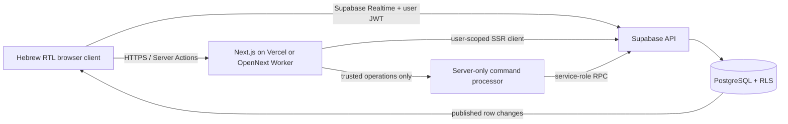
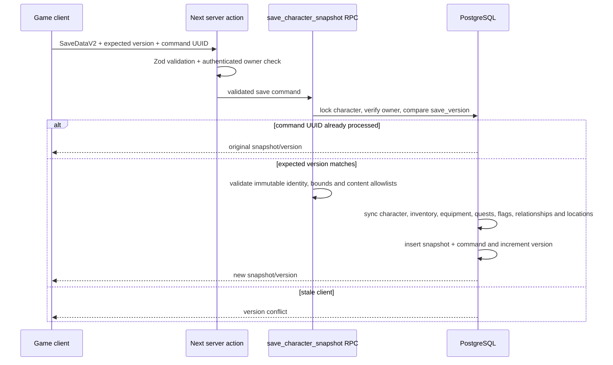
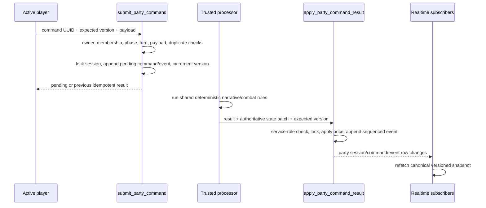

# Architecture

This document describes the production architecture of The Shattered Crown. The central rule is that presentation, deterministic game rules, authored content, persistence, and multiplayer authority remain separate. Single-player and party play consume the same domain rules; party play adds an authoritative command boundary rather than a second game engine.

## Runtime topology



The browser may read only rows allowed by RLS and may submit only supported commands. It never receives the service-role key and never applies an authoritative party result or persistent reward directly.

## Source layout

```text
src/
  app/                    App Router pages, route handlers, errors, and loading UI
  components/             Presentation grouped by auth, game, combat, party, and UI
  content/                Authored deterministic game definitions
  game/                   Pure game-domain rules
  lib/
    actions/              Authenticated server actions and RPC adapters
    assets/               Canonical local asset manifest
    audio/                Browser audio lifecycle
    auth/                 Protected-route helpers
    game/                 Runtime composition and persistence adapters
    party/                Party queries, Realtime, validation, and error mapping
    supabase/             Browser, server, service-role, and proxy clients
    validation/           Zod input validation
  store/                  Scoped client game state
  types/                  Domain and generated-style database contracts
scripts/
  validate-migration.mjs  In-memory migration/seed and transactional-save smoke test
supabase/
  migrations/             Ordered PostgreSQL schema changes
  tests/                  RLS and security contract tests
  seed.sql                Idempotent authored reward definitions
tests/
  unit/                   Pure domain tests
  integration/            Component and boundary tests
  e2e/                    Browser flows
public/assets/art-v2/     Art-directed scenes, portraits, class previews and King icons
public/assets/rebuild/    Local optimized content icons and compatibility assets
open-next.config.ts       Cloudflare OpenNext adapter configuration
wrangler.jsonc            Cloudflare Worker runtime, assets, images, and observability
```

## Application and rendering boundary

Next.js Server Components load the authenticated profile, character summaries, character relational state, and party snapshots. Interactive systems are Client Components and receive validated initial data rather than querying unrestricted tables on mount.

`src/middleware.ts` refreshes Supabase Auth cookies and protects `/menu`, `/characters`, `/game`, `/party`, and `/profile`. It calls `auth.getUser()` rather than trusting a locally decoded session. The legacy middleware filename is intentional for Cloudflare: Next.js 16's renamed Proxy convention is fixed to the Node.js middleware runtime, which OpenNext Cloudflare does not yet support. `requireUser()` repeats the server-side ownership boundary for protected Server Components.

The root layout sets `lang="he"` and `dir="rtl"`, loads local Hebrew fonts, and installs shared providers. Mixed-direction identifiers such as room codes and numeric fractions use LTR isolation at the component boundary.

## Authentication and profiles

Authentication uses Supabase email/password Auth through server actions:

1. The form is validated with Zod.
2. A server action calls the official Supabase SSR client.
3. Supabase writes or rotates the session cookies.
4. `/auth/callback` exchanges confirmation or recovery codes for a session.
5. Protected routes validate the user against Supabase Auth.

The `on_auth_user_created` trigger creates `public.profiles` from trusted `auth.users` data. Public party views expose display names and game metadata, not private email addresses.

Logout invalidates the Auth session and leaves cloud characters intact. Character-creation drafts in `sessionStorage` are temporary input resilience, not account identity or the primary save store.

## Domain engine

The modules under `src/game` are framework-independent and deterministic wherever synchronization matters:

- `character`: point-buy cost, attribute modifiers, derived stats, and starter builds.
- `dice`: seeded xorshift32 rolls, advantage/disadvantage, modifiers, and critical outcomes.
- `dialogue`: condition evaluation and typed story effects.
- `quests`: objective visibility, transitions, completion, and one-time reward state.
- `inventory`: item use and equipment validation.
- `progression`: experience thresholds and level changes.
- `combat`: initiative, actions, costs, cooldowns, statuses, enemy logic, scaling, and event logs.
- `multiplayer`: command envelopes, precondition checks, version conflicts, idempotency, and vote tie-breaking.
- `persistence`: Zod save schemas, migration, parsing, and serialization.
- `narrative`: the authored `NarrativeProvider` implementation and future provider abstraction.

Randomness is represented by a seed that advances with the state. A synchronized action must use the authoritative seed and persist the resulting seed; a client-provided outcome is never trusted.

## Authored content

`src/content` contains typed data rather than UI logic. Stable IDs link chapters, scenes, locations, interactions, dialogue nodes, quests, NPCs, items, abilities, statuses, enemies, and encounters.

`AuthoredNarrativeProvider` implements the `NarrativeProvider` interface with deterministic repository data. A future AI-backed provider can implement the same interface, but the opening chapter has no AI runtime dependency.

Content integrity tests verify important cross-references. Adding content must preserve referential integrity across TypeScript definitions, database allowlists, rewards, and asset keys. See [CONTENT_GUIDE.md](./CONTENT_GUIDE.md).

## Character creation and persistent state

The browser sends a validated character draft and a command UUID to `createCharacterAction`. The `create_character` RPC independently validates:

- authenticated ownership;
- name, race, class, background, portrait, and attribute ranges;
- the 27-point budget;
- idempotency through `character_creation_requests`.

It creates the relational character, attributes, starter inventory, equipment, quest, discovered location, and initial snapshot in one database transaction. A repeated command UUID returns the existing character instead of duplicating it.

Relational tables remain the queryable source for ownership, current stats, inventory, equipment, quests, relationships, flags, discovered locations, and chapter completions. Save snapshots capture a complete, versioned checkpoint for fast continuation and recovery.

## Save versioning and load flow

The current application save schema is `SaveDataV2`:

- character and derived state;
- inventory and equipment;
- quest and objective states;
- story flags, relationships, reputation, current scene, and location;
- journal, playtime, rewarded-event IDs, and timestamp;
- discovered locations and active checkpoint.

`saveDataV1Schema` remains readable. `migrateSave()` upgrades v1 to v2 by deriving discovered locations and a checkpoint ID. Unsupported or corrupt structures fail Zod validation and are not applied silently.

The save flow is transactional. A successful call updates the normalized rows and the recovery snapshot together; it is not a snapshot-only write:



The RPC derives progression-sensitive values such as level from validated experience and preserves server-owned metadata rather than trusting the client copy. Collection sizes, quantities, equipment references, ownership, immutable character identity, and playtime deltas are checked inside PostgreSQL before any row is replaced.

On load, the server queries the owned character, normalized relational state, and latest snapshot. A valid compatible snapshot supplies narrative presentation state such as the current scene and journal. Security-sensitive character, inventory, equipment, quest, flag, relationship, and discovered-location state is normalized from relational rows and overlaid on that snapshot. If the snapshot is absent or invalid, the loader reconstructs a safe v2 state entirely from RLS-protected relational rows. This prevents an invalid snapshot from granting access, hiding a server-granted reward, or making the character disappear.

Persistent rewards use two separate guards:

- client save state records `rewardedEventIds` for deterministic replay protection;
- `reward_claims` enforces an idempotency UUID and a unique `(character_id, reward_key, scope_key)` database constraint.

## Database model

The initial migration creates these groups:

- Identity: `profiles`.
- Characters: `characters`, `character_attributes`, `character_inventory`, `character_equipment`, `character_quests`, `character_story_flags`, `character_relationships`, `character_discovered_locations`, and `character_chapter_completions`.
- Save authority: `save_snapshots`, `save_commands`, and `character_creation_requests`.
- Cooperative sessions: `parties`, `party_members`, `party_sessions`, `party_events`, `party_commands`, and `party_votes`.
- Rewards: `reward_definitions` and `reward_claims`.

Foreign keys, checks, partial unique indexes, and updated-at triggers enforce invariants even if an application caller is faulty. JSONB is limited to versioned snapshots, event payloads, command payloads, and flexible metadata; ownership and commonly queried state remain relational.

## RLS and security boundary

RLS is enabled for every game table. The migration first revokes table privileges and then grants the minimum operations required by authenticated clients.

Core policies and grants enforce:

- users can select and narrowly update only their profile;
- characters and private character state are visible only to the owner;
- party tables become readable only to active party members;
- a limited party roster is returned through `get_party_roster`;
- another player's private inventory is never exposed as party metadata;
- browser roles cannot insert party events, command results, or reward claims directly;
- leader-only behavior and character ownership are rechecked inside RPCs;
- authoritative result and reward functions are executable only by `service_role`.

Security-definer functions set an explicit `search_path`. Helpers live in a non-public `private` schema. A service-role client may exist only in a server-only module and must never be returned, serialized, logged, or imported by a Client Component.

## Party lobby and Realtime flow

Lobby mutations use authenticated server actions that call narrow RPCs:

- `create_party`
- `join_party_by_code`
- `set_party_ready`
- `start_party_session`
- `leave_party`
- `remove_party_member`
- `transfer_party_leadership`
- `close_party`
- `update_party_connection`

Those RPCs validate character ownership, active membership, room capacity, readiness, and leadership in the database. One character can belong to only one active party, and a party can have only one forming/active session.

The lobby client subscribes to `parties`, `party_members`, and `party_sessions`. A notification schedules a canonical snapshot refetch instead of trusting the Realtime row as complete state. The subscription cleanup removes the channel on unmount, preventing duplicate listeners. Online/offline events update the visible connection state and last-seen metadata.

On refresh, the server finds the selected character's active membership, loads the party roster and active session, and sends the client back to the existing scene rather than creating a new session.

## Authoritative session command flow

Every persistent multiplayer game action uses an envelope containing a unique command ID, session ID, owned character ID, expected session version, type, and typed payload.



`SUBMIT_DIALOGUE_VOTE` records one upserted vote per character. Vote resolution is service-role-only; the highest count wins and the leader breaks a tie. Authored non-skill interactions use `RESOLVE_INTERACTION`; d20 checks use `RESOLVE_SKILL_CHECK`, with the server supplying the random seed. Movement, encounter start, combat, item use, loot, and scene completion use the same versioned envelope. Commands become pending until a trusted processor resolves them. The browser cannot overwrite the complete `session_state`.

`party_events.sequence_number` provides an ordered stream, while session `version` provides optimistic concurrency. Command UUIDs make retries and double clicks idempotent. An out-of-turn combat action, stale expected version, reused command ID with different contents, or missing inventory item is rejected before state resolution. Authoritative item consumption and combat-vital changes are applied in the same PostgreSQL transaction as the accepted command result; a refresh cannot retain the effect while restoring the consumed item, or vice versa.

## Reconnection model

Realtime is a notification transport, not the source of truth. A reconnecting client:

1. restores Auth from cookies;
2. finds active party membership;
3. queries the active `party_session` and current version;
4. loads current character/save data;
5. resumes subscriptions;
6. refetches after subscription succeeds.

Because accepted commands and rewards are idempotent, repeating the last request after a network ambiguity returns the prior result rather than duplicating an attack, item use, or reward.

## Assets and audio

The canonical visual manifest is `src/lib/assets/manifest.ts`. It maps 140 stable illustration keys to local files under `public/assets/art-v2` and `public/assets/rebuild`; content and UI refer to keys, not remote URLs. Every scene has separate desktop and art-directed mobile variants. Every race portrait, NPC portrait, class preview, and King ability has a dedicated finished asset. Integrity tests reject missing files and placeholder/dummy/temporary/silhouette paths. `ASSET_CREDITS.md` records provenance, generation, processing, font licenses, Lucide's interface-icon license, and distribution notes.

The audio manager is a Client-only Web Audio lifecycle service. It unlocks after user interaction, tracks music/effects/mute state, fades ambience, disconnects nodes, and generates short procedural cues without missing runtime files. If recorded audio is added later, it must use the same lifecycle and licensing rules.

## Error and observability model

Player errors are mapped to natural Hebrew and do not include database messages or stack traces. App Router error boundaries provide retry paths. Server logs may contain internal IDs and error codes but must not contain access tokens, passwords, service-role keys, or private email addresses.

Expected conflict classes include expired Auth, validation errors, ownership failures, stale save/session versions, duplicate commands, unavailable items, closed/full parties, out-of-turn actions, and Realtime disconnects. A retry is offered only when the operation is safe or idempotent.

## Deployment boundary

Vercel runs the application through its native Next.js platform. Cloudflare runs the same full-stack application on Workers through `@opennextjs/cloudflare`; it is not a static Pages export. The committed OpenNext, Wrangler, static-header, and preview configuration preserves Server Components, Server Actions, Auth cookies, image handling, and authoritative party commands, but the Worker artifact must still be built and verified under `workerd` before release.

Supabase owns Auth, the database, RPC execution, and Realtime publication for both hosting targets. Migrations are applied before deploying code that depends on them. Public environment values must be available at build time and runtime; the service-role key remains an encrypted server-only hosting secret. Cloudflare currently has no R2 incremental-cache binding because authenticated game routes are dynamic and persistent game state lives in Supabase.

Remote correctness cannot be inferred from a local Next.js build or an in-memory migration check. A release must exercise Auth redirects and email, RLS with two real user sessions, save conflict handling, party reconnection, idempotent rewards, and Realtime in the target Supabase project. A Workers release additionally needs the same flow under the built OpenNext Worker, not only `next dev`.

## Architectural invariants

- All player-facing text is natural Hebrew and rendered with true RTL.
- The browser never receives `service_role` or a database password.
- Ownership comes from `auth.uid()`, never a client-provided owner ID.
- Content definitions do not import React or Supabase.
- Domain rules do not import UI components.
- Realtime announces change; versioned database state remains canonical.
- Every retriable mutation has an idempotency key or a naturally idempotent database constraint.
- Save schema changes include a migration and tests.
- Shared-environment database changes use new ordered migrations.
- Visible assets are local, manifested, optimized, and credited.
